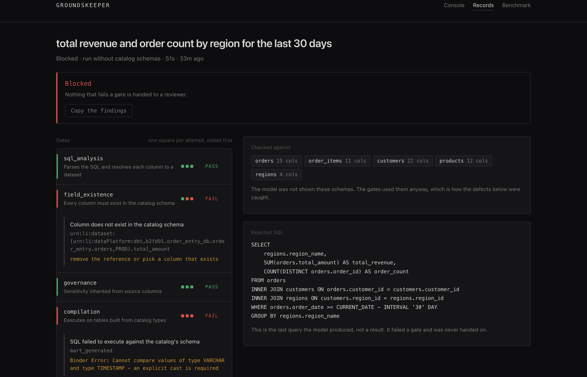
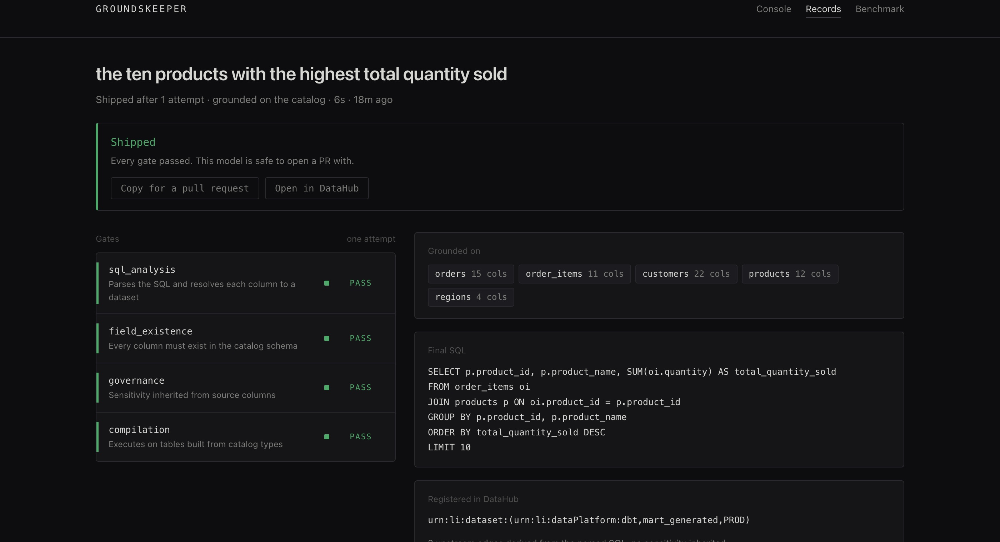
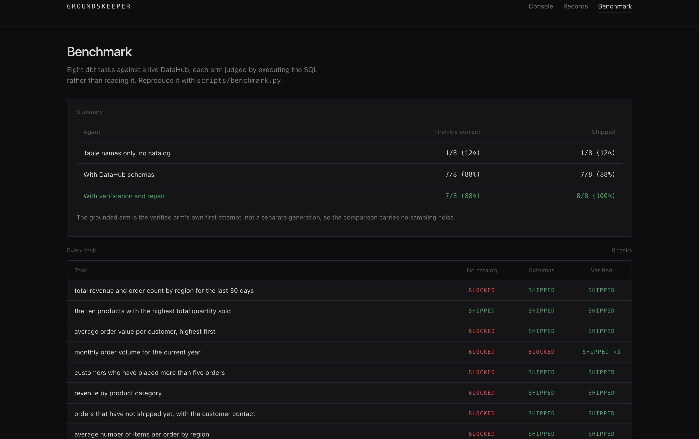

# Groundskeeper

[](https://github.com/calderbuild/groundskeeper/actions/workflows/ci.yml)

**An agent that writes dbt models from your real catalog, then proves the SQL is correct before you see it.**

Built for [Build with DataHub: The Agent Hackathon](https://datahub.devpost.com/) — Track 2, Metadata-Aware Code Generation.

---

## The problem

Ask any LLM for a dbt model and you get SQL that looks right. That is the problem. It compiles in your head, passes review, and fails in production, because the model guessed a column name that sounds correct and isn't.

Here is a real generation from this repo's benchmark, asked for revenue by region with only the table names — no catalog:

```sql
SELECT regions.region_name,
       COUNT(DISTINCT orders.order_id) AS order_count,
       SUM(order_items.price * order_items.quantity) AS total_revenue
FROM orders
JOIN order_items ON orders.order_id = order_items.order_id
...
WHERE orders.order_date >= CURRENT_DATE - INTERVAL '30 days'
```

Two defects a reviewer would very likely miss:

1. `order_items.price` does not exist. The column is `unit_price`.
2. `orders.order_date` is a `VARCHAR` in this warehouse, so comparing it to a date throws at runtime.

Groundskeeper catches both before the model is ever offered.

## The console

Three surfaces, one standard-library server, no build step.

| Where | What it answers |
|---|---|
| `/` | What is happening right now: gates deciding, live, over SSE |
| `/runs/<id>` | What happened, as a permalink you can paste into a pull request |
| `/benchmark` | Why any of this should be trusted, per task rather than in aggregate |



The record of one real run, without the catalog in front of the model. `field_existence` rejects a column that does not exist; `compilation` rejects a date comparison because `order_date` is a `VARCHAR`. Both defects are in SQL that reads perfectly, and neither reached a reviewer.

Each gate carries its own history. The small squares beside it are that gate's verdict on every attempt, so which gate failed, when, and whether the repair worked is legible in one object. Here `field_existence` passed, then broke, and stayed broken.



A run that passed every gate, with the lineage it wrote back to DataHub.



Every run is written to `runs/` as plain JSON, which is what makes the permalink and the history work without a database.

## What it does

```
request ─▶ GROUND ─▶ GENERATE ─▶ VERIFY ─▶ repair ─┐
             ▲                      │              │
        DataHub MCP            fails? ─────────────┘
     (schemas, types, tags)         │
                                 passes ─▶ dbt model + evidence report
```

Every candidate model is analyzed and put through gates that can each block it:

| Gate | Checks | Catches |
|---|---|---|
| `sql_analysis` | parses SQL, resolves each column to a dataset per scope | unparseable SQL, ambiguous unqualified columns, tables not in the catalog |
| `field_existence` | every column against `list_schema_fields` | hallucinated columns, near-miss typos, case drift |
| `governance` | source-column PII/sensitivity vs the output's tags | PII copied into an untagged output |
| `compilation` | executes the query on DuckDB tables built from catalog schemas | type errors, bad joins, invalid aggregates |

A failure becomes a specific repair instruction and the generator gets another attempt. Missing metadata produces an **escalation** instead — the run stops and asks a human, because no amount of retrying will invent a schema DataHub does not have.

## Results

Eight realistic dbt tasks against the `showcase-ecommerce` datapack (6 tables, live DataHub). Every result decided by **executing** the generated SQL, not by reading it:

| Agent | First-try correct | Shipped |
|---|---|---|
| Table names only, no catalog | 1/8 (12%) | 1/8 (12%) |
| + DataHub schemas (grounded) | 7/8 (88%) | 7/8 (88%) |
| + verification & repair | 7/8 (88%) | **8/8 (100%)** |

DataHub's context graph is what moves 12% to 88%. The gates close the rest and, more importantly, are the reason anyone can state these numbers at all — in the ungrounded arm they blocked 7 broken models from reaching a reviewer.

The grounded arm is the verified arm's own first attempt, not a separate generation, so the comparison carries no sampling noise. Raw per-task results: [`examples/benchmark.json`](examples/benchmark.json). Re-run it yourself with `scripts/benchmark.py`.

## Use of DataHub

DataHub is the load-bearing dependency, not a data source that could be swapped for a JSON file:

- **MCP Server** (`mcp-server-datahub`) — `search`, `list_schema_fields` for real schemas, native types, and column-level governance tags
- The catalog's **types** build the DuckDB warehouse the compilation gate executes against, so "does it run" is answered against the real shape of the data
- The catalog's **governance tags** propagate to generated outputs, so PII cannot be laundered into an untagged model
- Uncatalogued tables and unclassified columns **escalate** rather than pass, which turns metadata gaps into visible work instead of silent risk

## Contributed back

[datahub-project/datahub#18633](https://github.com/datahub-project/datahub/pull/18633) — `package_data` declared `datahub.cli.resources`, but the datapack agent-context file and the bundled offline registry live in `datahub.cli.datapack.resources`, so neither shipped in the wheel. `datahub datapack --help` raised `FileNotFoundError` whenever stdout was not a tty — which is exactly how an agent or CI job calls it — and the offline registry fallback could never load. Found while building this project, since `datahub datapack load` is the first command the hackathon's own resources page points people at.

## Quickstart

```bash
# 1. DataHub (Colima or Docker Desktop both fine)
pip install acryl-datahub
datahub docker quickstart
datahub datapack load showcase-ecommerce

# 2. Groundskeeper
uv venv --python 3.11
source .venv/bin/activate          # Windows: .venv\Scripts\activate
uv pip install -e ".[dev]"

# 3. Any OpenAI-compatible model
export GROUNDSKEEPER_API_KEY=...
export GROUNDSKEEPER_BASE_URL=https://api.deepseek.com/v1   # optional
export GROUNDSKEEPER_MODEL=deepseek-v4-pro                  # optional
export DATAHUB_GMS_URL=http://localhost:8080
export TOOLS_IS_MUTATION_ENABLED=true DATA_QUALITY_TOOLS_ENABLED=true

# 4. Generate a verified model
python scripts/run_task.py "total revenue and order count by region for the last 30 days"

# 5. Watch it work in the browser
python scripts/console.py          # http://127.0.0.1:8765

# 6. Reproduce the benchmark
python scripts/benchmark.py
```

`--ungrounded` withholds the catalog schemas and `--no-gates` disables verification, so you can watch the failure modes directly.

## Layout

```
src/groundskeeper/
  catalog_loader.py   MCP session, dataset discovery, schema loading
  context.py          schemas, native types, column governance tags
  sql_analysis.py     scope-aware column resolution (sqlglot)
  warehouse.py        DuckDB built from catalog schemas
  generator.py        LLM, grounded or not
  pipeline.py         generate → verify → repair, and the evidence report
  writeback.py        registers the verified model with lineage and tags
  store.py            durable run records, one JSON file each
  server.py           SSE stream and JSON API (standard library only)
  gates/              field_existence, governance, compilation
  console/            console, records and benchmark (single file, no build step)
scripts/              run_task.py, benchmark.py, console.py, e2e_gate_probe.py
examples/             benchmark results, verification transcripts
runs/                 run records, written as you go (gitignored)
tests/                55 tests, no DataHub required
```

## Tests

```bash
python -m pytest tests/ -q     # 55 passed
```

They cover the behaviour the project claims: hallucinated columns rejected and repaired, type errors caught only by execution, unqualified columns in joins refused rather than guessed, CTE names not mistaken for missing tables, escalation never burning retries on absent metadata, and a run record that survives the trip to disk saying the same thing it said on screen.

They also check the table above against `examples/benchmark.json` itself, so the headline numbers cannot drift from the runs they came from. One of those tests encodes the invariant an earlier version of this benchmark broke: the verified arm cannot ship less than grounding alone, because it *is* grounding plus repair, and a result below it means the arms were sampled separately and compared across noise.

CI runs them on 3.10, 3.11 and 3.12 with only `duckdb`, `sqlglot` and `pytest` installed, and fails if `acryl-datahub` is present, so "no DataHub required" stays a fact rather than a claim. A second job builds the wheel, installs it alone, and reads the console through the installed package — the failure this project reported against DataHub was a wheel that installed cleanly while missing a file read at runtime, and Groundskeeper had the same defect until it was caught the same way.

## Notes and limits

- Verification proves a model is *executable and consistent with the catalog*. It does not prove the business logic answers the question asked — that still needs a human, which is why the evidence report exists.
- The DuckDB warehouse is schema-only. Empty tables are enough to surface type and join errors, and seeding rows would prove nothing extra.
- Type mapping from warehouse-native types is deliberately permissive; an unrecognised type becomes `VARCHAR` rather than failing a query for a reason unrelated to the generated SQL.

## License

Apache 2.0.
